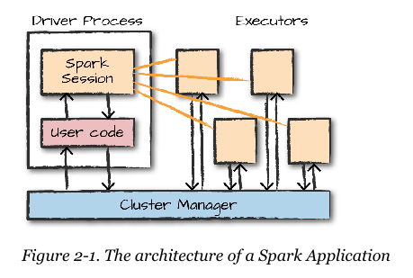

% Spark the Definitive Guide 2nd Edition
% Chapter 02
% A Gentle Introduction to Spark

# A Gentle Overview

## Text Book

## Core Architecture

## Spark's Basic Architecture 22

- Single Computers work pretty well
- Powerful
- But only one machine
- This limits what can be done
- Single machines don't have the necessary power or the parallel ability
- Multiple computers alone are not enough -- you need a framework to control the data
  - To schedule data movement and data processing

## Spark Cluster Manager

- Spark has its won software based cluster manager.  
- Configurable out of the box
  - Simple config file denoting if the node is a slave or master
- Spark can also use existing cluster managers:
  - YARN from Hadoop 2.x/3.x
- [Mesos](https://mesos.apache.org "Apache mesos web site")
  - Cluster scheduler created by Twitter
  - Still in use, we won't focus on Mesos in this class
- We will work initially with the built in Spark cluster manager
- YARN later in the semester when we move to cluster work

## Conclusion

- Spark is great
