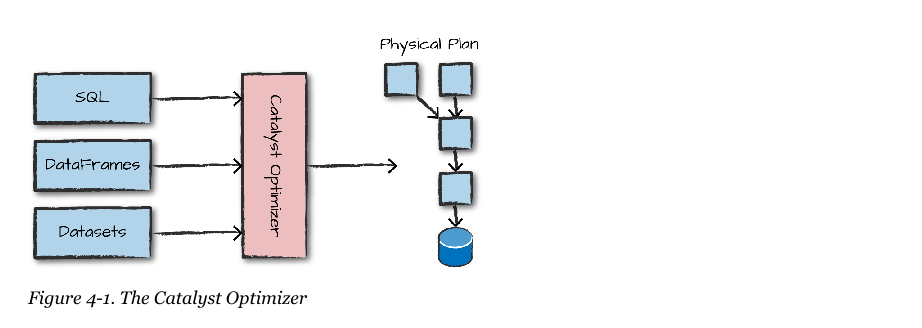

% Spark the Definitive Guide 2nd Edition
% Chapter 04
% Structured API Overview

# Structured API Overview

## Text Book


## Objectives and Outcomes

- Introduced to Spark's Structured APIs, DataSets, DataFrames, and SQL Views
- Learn how Spark transforms into a physical execution plan on a cluster

## Review

So far:

- We learned about Spark's programming model
- We learned how to run production code
- We were introduced to type-safe data structures in Spark
- We were introduced to Structured Streaming on Spark
- We were introduced to Machine Learning on Spark
- We were introduced to 3rd party Spark packages

## API Overview 66

- Three datatypes in Spark:
  - DataFrames
    - Can you define this term?
  - Datasets
    - Can you define this term?
  - SQL Tables and Views
    - Can you define these terms?
- With these data types we can manipulate disparate types of data
  - Unstructured log files
  - Semi-structured CSV files
  - Structured Parquet files

## Structured API concepts

- These concepts refer to both *batch* and *streaming*
  - Code should easily switch between the two
  - We will cover Streaming later in the course, Chapter 20

## Structured Collections

- Spark has two notions of structured collections:
  - Datasets and DataFrames
- Each are distributed table-like collections with well defined rows and columns
  - Each row must have the same number of columns
  - Both are **immutable**
  - Both allow for lazily evaluated plans that are only deployed when an **action** is called

## Schemas

- A **schema** defines the column names and data types of the column
  - Schemas can be defined manually or inferred
  - Schema on Read
- All of Spark actions take place in the internal Spark language called Catalyst
  - We don't write in this language but the JVM allows us to write in higher level languages that convert to Catalyst

## DataFrames vs Datasets

- DataFrames have types of a sort...
  - These are maintained by Spark internally
  - Schema only checked at *runtime*
- Datasets are typed DataFrames
  - Only available in Scala and Java
  - Enforce type at compile time
  - P. 54

## Overview of Structured Spark Types

- Spark is effectively a programming language of its own
  - Uses the *Catalyst* engine internally to maintain type information
- This code does not do math in Scala, but Catalyst:
  - ```scala
  val df = spark.range(500).toDF("number")
  df.select(df.col("number") + 10)```

## DataFrames vs. Datasets

- DataFrame schema checked at *runtime*
- Dataset schema checked at *compile time*
  - Datasets only available in Java and Scala
  - Why?
- DataFrames are Datasets of type `Row`
  - Type `Row` is Spark's internal optimized in-memory format for computation P.54
- Even without Datasets in Python and R, we are still always working on an optimized in-memory datatype

## Columns and Rows

- Columns represent a 3 types of data:
  - A *simple type* like an integer or string
  - A *complex type* like an array or map
  - A *null value* :!
- A row is nothing more than a record of data
- Each record in a DataFrame must be of type `Row`
- Rows can be created in numerous ways:
  - Via SQL statements
  - DataSources (ingesting)
  - dynamically and in memory
  - ```spark.range(2).toDF().collect()```

## Spark Types

- You can import the types library you want to work with in Scala
  - ```import org.apache.spark.sql.types._```
  - ```val b = ByteType```
- You can import the types library you want to work with in Java
  - ```import org.apache.spark.sql.types.DataTypes;```
  - ```ByteType x = DataTypes.ByteType;```
- You can import the types library you want to work with in Python
  - ```from pyspark.sql.types import \*```
  - ```b = ByteType()```
- Page 56 has an entire table of all the data type libraries available  

## Overview of Structured API Execution

- Structured API execution happens in 4 steps on Page 58:
  - Write your DataFrame/Dataset/SQL code
  - If valid code, Spark converts this to a *Logical Plan*
  - Spark transforms this *Logical Plan* to a *Physical Plan*, checking for optimizations along the way
  - Spark then executes this *Physical Plan* on the cluster
  - 

## Logical and Physical Planning


## Logical Planning

- The first phase takes the user code and converts it into a logical plan
  - Purely to convert the code into the most optimized version
  - Spark has an unresolved logical plan
    - Your code may compile, but what if the table name or column name is wrong?
  - Spark uses a *catalog* - an internal repo of all table and DataFrame information
  - Then *resolves* column and *tables* in the *analyzer*
- The analyzer might reject an *unresolved logical plan*, otherwise pass it to the *Catalyst Optimizer*
  - A collection of rules that attempts to optimize the logical plan by pushing predicates or selections down

## Physical Planning

- After an optimized plan is generated.
  - Spark begins to specify how this plan will be executed on the cluster
  - Creates multiple strategies and compares them via a *cost model*
  
- At execution time, Java bytecode is generated and the final result returned to the user

## Conclusion

- We were introduced to Spark's Structured APIs, DataSets, DataFrames, and SQL Views
- We learned how Spark transforms into a physical execution plan on a cluster

## Questions

- Any questions?
- Read Chapter 05 and do any exercises in the book.
