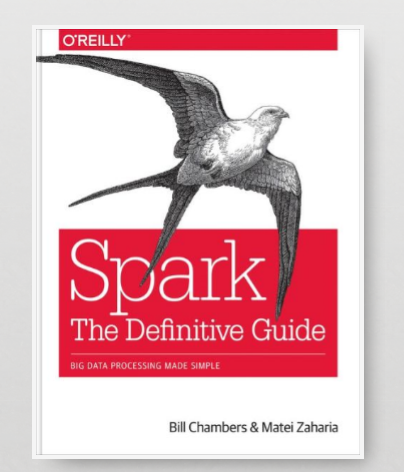

% Spark the Definitive Guide 2nd Edition
% Chapter 07
% Aggregations

# Aggregations

## Text Book



## Objectives and Outcomes

- Aggregating is the act of collecting something together
  - It is the cornerstone of big data analytics
- You specify a *key* or *grouping* and an *aggregation function*
  - This function specifies how you should transform one or more columns
- Spark allows us to create the following types of groupings:
  - A *"group by"* specifies one or more keys and one or more aggregations
  - A *"window"* specifies one or more keys and one or more aggregations to transform the value columns
  - A *"grouping set"* specifies you can use aggregations at multiple levels
  - A *"rollup"* specifies one or more keys as well as one or more aggregation functions to transform the value of a column
  - A *"cube"* specifies one or more keys as well as one or more aggregations to transform the value columns

## Review

- So far:
  - We learned how to build expressions using typed data
  - We learned how to use:
  - Booleans
  - Numbers
  - Strings
  - Dates and Timestamps
  - Nulls
  - Complex and user types
  
## Basic Aggregations

- One of the simplest aggregations is `count()` which will count all rows in a DataFrame
  - ```df.count()```{.python}
  - `.count()` is technically an action not a transformation
- Elements of an entire column can be counted as well
  - ```from pyspark.sql.functions import count```{.python}
  - ```df.select(count("StockCode")).show()```{.python}
  - Watch out!  When counting all columns ("*") Spark will count `nulls`, even rows that are all `null`
  - When counting an individual column, Spark will not count `nulls`

## countDistinct

- Sometimes total number is not relevant, only unique number is
  - There is a ```.countDistinct()``` function
  - ```from pyspark.sql.functions import countDistinct```{.python}
  - ```df.select(countDistinct("StockCode")).show()```{.python}
- There is also an ```.approx_count_distinct()```{.python}
  - When working with a large dataset, time, processing power, even energy usage are a consideration
  - There are times when a degree of approximation can be used without an issue
  - ```from pyspark.sql.functions import approx_count_distinct```{.python}
  - ```df.select(approx_count_distinct("StockCode", 0.1)).show()```{.python}
  - ```SELECT approx_count_distinct(StockCode, 0.1) FROM dfTable```{.sql}
  - 0.1 is the estimation error margin
  - Note the results, but note the performance gain

## Simple Aggregations

- You can get the first and last elements of a DataFrame by two obvious elements
  - .first()
  - .last()
- You can extract min and max values using the builtin pyspark sql functions
- You can use the `sum` method to sum the content of a column
  - There is also a `sumDistinct` function that will perform that actions as well
- There is an `avg` function to do an average of a column
  - You can combine this result with an alias to reuse the calculated value later 107
- If you are calculating Average, then you are dealing with *Variance* and *Standard Deviation*
- *Skewness* and *kurtosis* are both measurements of extreme points in your data
  - Skewness measures the asymmetry of your values around the mean
  - Kurtosis measures the tail of data

## More Simple Aggregations

- Some functions compare the interactions of the values in two different columns together
  - *Covariance* and *Correlation*
  - `cov` and `corr`
  - Chapter 6 talked about the [Pearson correlation coefficient](https://en.wikipedia.org/wiki/Pearson_correlation_coefficient "Pearson Correlation coefficient wiki page")
  - Correlation is measured on a -1 to 1 scale
  - The covariance can be taken over a population sample or the entire population of records 110

## Grouping

- We have done ```groupBy```{.python} on the DataFrame level aggregations
  - We can perform calculations based on *groups* in the data
  - Using our purchase data DataFrame, for example we can group on unique **invoice number** and do a ```count()``` of items on that invoice
  - This returns a second DataFrame that is lazily evaluated
  - ```df.groupBy("InvoiceNo","CustomerId").count().show()```{.python}
  - ```SELECT count(*) FROM dfTable GROUP BY InvoiceNo, CustomerId```{.sql}
- We can specify an arbitrary expression statement as an ```agg``` statement
  - This makes it possible to say *alias* a column
  - ```df.groupBy("InvoiceNo").agg(count("Quantity").alias("quan"), expr(count(Quantity)")).show()```{.python}

## Grouping With Maps

- Sometimes it can be easier to specify your transformations as a series of **Maps**
  - For which the key is the column 
  - The value is the aggregation function that you would like to perform
- ```df.groupBy("InvoiceNo").agg(expr("avg(Quantity)"),expr("stddev_pop(Quantity)")).show()```{.python}

## Window Functions 112

- Window Functions can be used to carry out aggregations by computing on a certain *window* of data
  - This sounds very similar to a ```groupBy```{.python} function, so what is the difference?
  - ```groupBy```{.python} takes data and every row can only go into one grouping
  - A Window function calculates a return value for every input row of a table based on groups of rows, called a **frame**
    - Not a DataFrame
  - Each row can fall into one or more frame, unlike a ```groupBy```{.python}
  - 


## Example of a Window

- 

## Conclusion

- Conc goes here

## Questions

- Any questions?
- Read Chapter 08 & 09 and do any exercises in the book.
