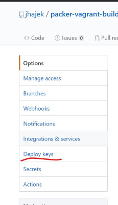
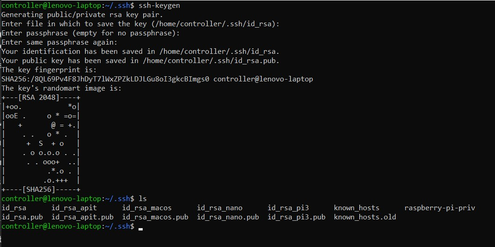
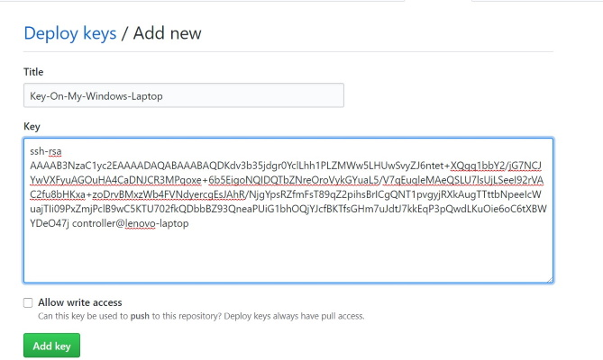

# Automation Demo

This is a small demo that will show the concepts of application automation

## Objectives

* Discuss and explain issues of authentication and access with automation
* Understand secrets management and discuss potential software solutions
* Discuss and understand the creation and use of SSH/RSA keys
* Discuss and understand software automation solutions

## Outcomes

At the end of this demonstration you will be able to deploy two sample applications.  The first involving pre-seeding a root password for a database (MariaDB) and pre-seeding 3 records into the database via automation software and from a private GitHub repo.  The second will involve deploying a small NodeJS application and application code as well as a proxy frontend from a private GitHub repo.

## Setup

For this demonstration, you need to have Packer, Vagrant, and VirtualBox installed.  If you completed the Tooling Assignment then you will have the correct tools.

You can clone the sample code I will be using--issue the command:

```bash
git clone https://github.com/jhajek/packer-vagrant-build-scripts.git
```

In this repo, under the folder named Packer > itmt430 you will find a detailed [Readme.md](https://github.com/jhajek/packer-vagrant-build-scripts/blob/master/packer/itmt430/ReadMe.md "Detailed Sample Project Repo Link").  The content of that link will be reprinted here.

### Initial Problem

How can you clone code from a private GitHub Repo?   When you do so on the command line you are prompted for a password.  This breaks automation.  Git and GitHub have a solution.  You can add an RSA Public Key to GitHub (called a Deploy Key) and clone over SSH as opposed to https.

### Pre-steps

Secrets management (passwords, keys, key/value pairs) is the one of the main focuses of cyber-security as well as any application health.  In building a application via automation tools, we have the concern of how we will place secrets into our new Operating System as well as how we will retrieve application code securely from a private GitHub repository.

We will be using [SSH/RSA](https://en.wikipedia.org/wiki/RSA_\(cryptosystem\)) keys to authenticate between your system and GitHub.  You might have heard these referred to as public/private key authentication. You will need to generate a keypair.  This can be done by issuing the following command from a shell on Mac, Linux, and PowerShell/Windows:

```bash
ssh-keygen
```

You can accept the defaults by hitting enter.  In this case we don't want a passcode for our key.  If you have not generated a keypair before, two files `id_rsa` and `id_rsa.pub`  will be generated in the `~/.ssh` directory.  One is the private key, one is the public key.  

Upon being made an admin of your team's GitHub repo, you will now have the ability to add public keys to your repo.  GitHub refers to these as **Deploy Keys**.  




Open your Public Key and paste the content into a new GitHub Deploy Key. Give the name a very descriptive key name so you can remember where the key is located.  You don't want to be reusing keys or passing them around.  You can generate and add as many keys as you want to.






### SSH Config

What happens when we run this command?

```bash
# replace hajek.git with your teams or your own private repo name
git clone git@github.com:illinoistech-itm/hajek.git
```

You are prompted with a yes/no prompt, which will prevent an automated cloning.


There is a way to disable the fingerprinting.   It involves creating a file called `config` and placing it in your `~/.ssh` directory. This `config` file is an SSH default file that any SSH connection will read automatically.   This helps setup FQDNs or complicated file paths and saves you the time to type them.  The file should contain this content at the least:

```bash
Host   github.com
Hostname github.com
IdentityFile  /home/vagrant/.ssh/id_rsa
StrictHostKeyChecking no
```

* The value ```StrictHostKeyChecking``` is what turns off the fingerprint checking.  
* The `IdentityFile` value should point to your private key location (id_rsa)

After adding the `config` file, we now encounter a file permission error.  You will see the issue here is that GitHub requires the file to be permission 600 if you are on Linux or Mac, but not Windows.  


One aspect of cloning via SSH is we now introduce the concept of fingerprinting, or anti-man-in-the-middle.

## Packer User-Variables

In this example we will be using Packer and Vagrant.  Packer will be used to construct and automate the build of our application.  Packer makes use of `scp` commands during its post-provisioner phase in order to allow files and other secrets to be transferred.  

[https://www.packer.io/docs/templates/user-variables.html](https://www.packer.io/docs/templates/user-variables.html)

## What we need to set username and passwords securely in Packer

1) Issue the command inside of the folder, ```cp variables-sample.json variables.json```
    1) The ```variables.json``` file contains key value pairs of variables and passwords to be passed into the provisioner shell script.
    1) This renames the file ```variables-sample.json``` to ```variables.json```  (There is an entry in the `.gitignore` so you cannot accidentally `git push` your passwords).
1) Edit the ```variables.json``` file replacing default values with your own
1) Issue the command ```packer build --var-file=./variables.json ubuntu18044-itmt430-database.json``` and ```packer build --var-file=./variables.json ubuntu18044-itmt430-webserver.json``` to begin the install with password, usernames, and RSA private key properly seeded
1) This way we can securely build the system, deploy it and when building it pass in passwords via environment variables

## Webserver contents

1) This application has an Nginx webserver running on port 80.  
1) It has a Nodejs Hello World application running on port 3000.
1) It has an Nginx route to the Nodejs app located at `/app`

## Database contents

1) System will create a `.my.cnf` file which allows for password-less authentication
1) System will pre-seed MariaDB or MySql root password